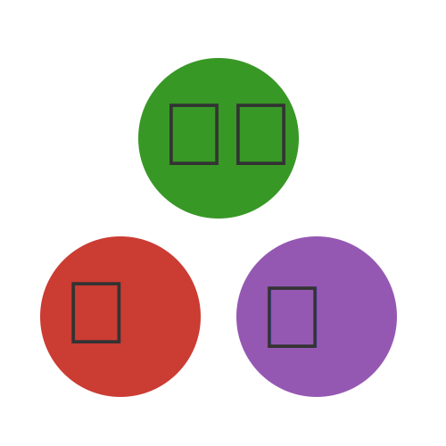

<h1 align="center">
    
ClimaAnalysis.jl
</h1>

  <strong>Analyzing and visualizing ClimaAtmos simulations</strong>

`ClimaAnalysis.jl` is a Julia library to post-process and visualize `ClimaAtmos`
simulations.

Check out the documentation for more information and tutorials.

## Features

- Read, organize, and process NetCDF files
- Visualize heatmaps and 1D profiles with `CairoMakie`
- Apply averages and other reductions to the output variables.
- Slice variables along a given value (e.g., take the slice with altitude of 500 meters)
