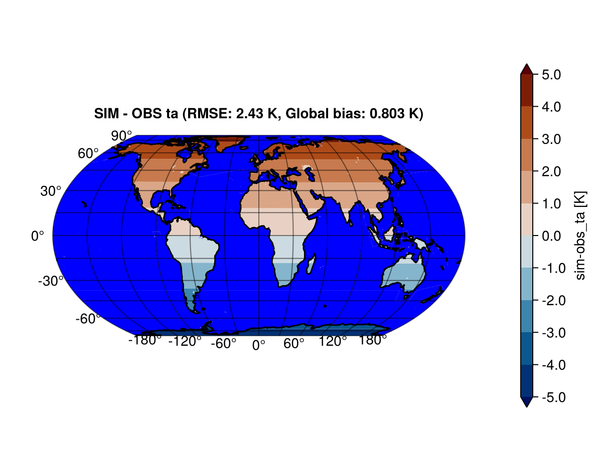
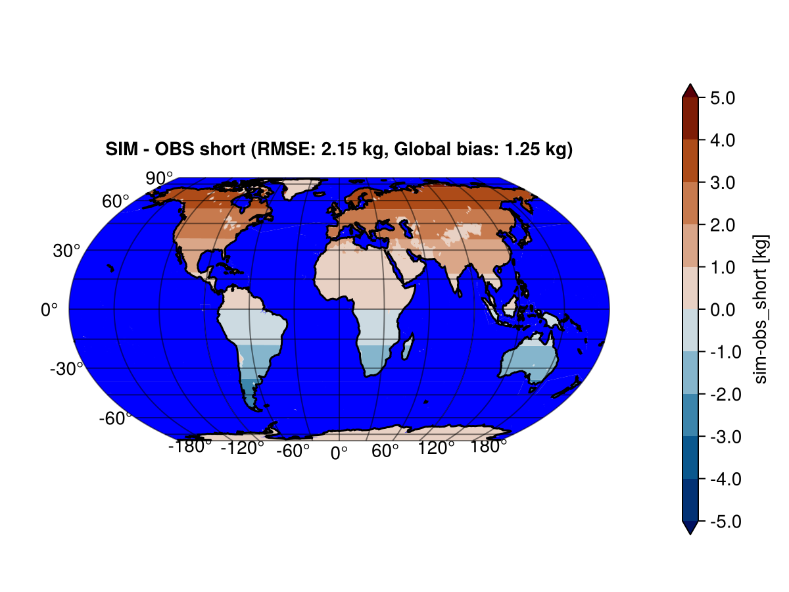

# Visualizing `OutputVar`s

This page is under construction, in the meantime, consult [`Visualize`](@ref).

### Masking part of the output in `GeoMakie`

When performing ocean or land simulations, it is often convenient to hide the
other component (e.g., hide the ocean and focus on the continents). For
`GeoMakie` plots, there is a direct way to accomplish this. In this section, we
discuss this feature.

The main `GeoMakie` plots are [`Visualize.contour2D_on_globe!`](@ref) and
[`Visualize.heatmap2D_on_globe!`](@ref). Both these functions take a `mask` argument. By
default, `mask` is `nothing`, meaning that the entire output is displayed on the
globe. Alternatively, `mask` can be a collection of polygons that can be plotted
with [`Makie.poly`](https://docs.makie.org/v0.21/reference/plots/poly).
`ClimaAnalysis` comes with the most important ones [`Visualize.oceanmask`](@ref) and
[`Visualize.landmask`](@ref), to hide ocean and continents respectively.

For example, suppose `var` it the variable we want to plot with a ocean mask
```julia
import ClimaAnalysis.Visualize: contour2D_on_globe!, oceanmask
import ClimaAnalysis.Utils: kwargs as ca_kwargs
import GeoMakie
import CairoMakie

fig = CairoMakie.Figure()

contour2D_on_globe!(fig,
                    var,
                    mask = oceanmask(),
                    more_kwargs = Dict(:mask => ca_kwargs(color = :blue)),
                   )

CairoMakie.save("myfigure.pdf", fig)
```

In this example, we plotted `var` on the globe and overplotted a blue ocean.
`ca_kwargs` (`Utils.kwargs`) is a convenience function to pass keyword arguments
more easily.

The output might look something like:


### Plotting bias

After [computing the bias](@ref bias) between observational and simulation data, you may
want to plot the bias and display information such as the root mean squared error (RMSE) and
the global bias in the plot. To do this, you use the function [`plot_bias_on_globe!(fig, sim,
obs)`](@ref Visualize.plot_bias_on_globe!). In the example below, we plot the bias between our
simulation and some observations stored in `ta_1d_average.nc`.

```julia
import ClimaAnalysis
import ClimaAnalysis.Visualize: plot_bias_on_globe!
import GeoMakie
import CairoMakie

obs_var = ClimaAnalysis.OutputVar("ta_1d_average.nc")
sim_var = ClimaAnalysis.get(ClimaAnalysis.simdir("simulation_output"), "ta")

fig = CairoMakie.Figure()
plot_bias_on_globe!(fig, sim_var, obs_var)
CairoMakie.save("myfigure.pdf", fig)
```

The output produces something like:


We can also plot the bias using an ocean mask. This also means we compute the bias only
over land.

```julia
import ClimaAnalysis
import ClimaAnalysis.Visualize: plot_bias_on_globe!, oceanmask
import GeoMakie
import CairoMakie

obs_var = ClimaAnalysis.OutputVar("ta_1d_average.nc")
sim_var = ClimaAnalysis.get(ClimaAnalysis.simdir("simulation_output"), "ta")

fig = CairoMakie.Figure()
plot_bias_on_globe!(fig,
                    var,
                    mask = oceanmask(),
                    more_kwargs = Dict(:mask => ca_kwargs(color = :blue)),
                   )
CairoMakie.save("myfigure.pdf", fig)
```

The output produces something like:



We can also plot the bias using a custom mask generated from `make_lonlat_mask`.

!!! note "Passing a masking function for `mask`"
    ClimaAnalysis do not support mask keyword arguments for masking functions. If you want
    the values of the mask to not show in a plot, then pass `true_val = NaN` as a keyword
    argument to `make_lonlat_mask`. The color of `NaN` is controlled by the keyword
    `nan_color` which can be passed for the plotting function (`:plot`).

    Note that if the backend is CairoMakie, then the keyword `nan_color` does nothing. See
    this [issue](https://github.com/MakieOrg/Makie.jl/issues/4524).

```julia
import ClimaAnalysis
import ClimaAnalysis.Visualize: plot_bias_on_globe!, oceanmask
import GeoMakie
import CairoMakie

mask_var = ClimaAnalysis.OutputVar("ocean_mask.nc")
mask_fn = ClimaAnalysis.make_lonlat_mask(mask_var; set_to_val = isnan)

obs_var = ClimaAnalysis.OutputVar("ta_1d_average.nc")
sim_var = ClimaAnalysis.get(ClimaAnalysis.simdir("simulation_output"), "ta")

fig = CairoMakie.Figure()
plot_bias_on_globe!(fig, var, mask = mask_fn)
CairoMakie.save("myfigure.pdf", fig)
```

The output produces something like:



